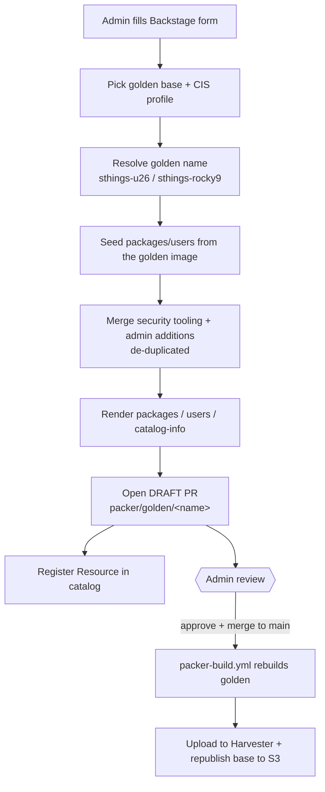

# Harvester Packer Admin-Image — Hardened Golden Template

> The **admin** counterpart to [`harvester-packer-devimage`](../harvester-packer-devimage/).
> Where the dev template is for *quick, self-service playground images*, this one
> curates the **golden** base images with a CIS hardening profile + security tooling
> and a **review-gated** (no auto-merge) GitOps flow.

| | Dev template | Admin template (this one) |
|---|---|---|
| Audience | Developers | Platform admins |
| Tier | `packer/dev/<name>/` | `packer/golden/<name>/` |
| Purpose | Quick playground VMs | Curated, hardened golden base images |
| Hardening | none | CIS Level 1 / Level 2 profile + security tooling |
| Target name | `u26-dev` / `rocky9-dev` | `sthings-u26` / `sthings-rocky9` |
| PR flow | auto-merge on green | **draft PR, manual review & merge** |

---

## What it does

This template curates an existing **golden** base image (`sthings-u26` /
`sthings-rocky9`): it seeds from the golden image's current package/user set, merges
in a chosen CIS profile's **security tooling** plus any admin additions, and opens a
**draft** PR against `packer/golden/<name>/`. Golden images are review-gated — the PR
is not auto-merged; a platform admin reviews and merges. After merge to `main`,
`packer-build.yml` rebuilds the golden image, uploads it to Harvester, and republishes
the base to S3 so dev images can layer on it.

## Form parameters

| Group | Field | Notes |
|---|---|---|
| Golden Base Image | `baseImage` | ubuntu26 (sthings-u26) / rocky (sthings-rocky9) |
| Hardening | `cisProfile` | CIS Level 1 (baseline) or Level 2 (defense-in-depth) |
| Hardening | `securityTooling` | Packages baked in (default: auditd, aide, fail2ban, unattended-upgrades) |
| Users | `users` | Same merge/de-dup semantics as the dev template |
| Packages | `packages` | Extra packages beyond the golden set + tooling |

## Generated files (in the PR, under `packer/golden/<name>/`)

- `packages.yaml` — golden packages + security tooling + admin additions (de-duplicated)
- `users.yaml` — golden users + admin additions (merged by name)
- `catalog-info.yaml` — Resource of type `packer-image-golden`, records `cisProfile`
  + `securityTooling` in its profile

The golden `build.pkrvars.hcl` (upstream `source_url`, image name, distro overrides)
is **not** regenerated — it is curated in-repo and this template only edits the
package/user/catalog files.

## Review-gated flow

1. Run the template → opens a **draft** PR against `packer/golden/<name>/`.
2. A platform admin reviews the change. The PR build (`packer-pr-build.yml`) is
   **validation-only** for golden — it builds to prove it works, but does not
   upload and does not auto-merge.
3. Mark the PR ready & merge. After merge to `main`, `packer-build.yml` rebuilds the
   golden image, uploads it to Harvester, and republishes the base to S3.
4. Dev images layered on this golden base pick up the change on their next build.

> **Note on CIS hardening.** Today the `cisProfile` is recorded as metadata and the
> selected `securityTooling` packages are installed into the golden image. The shared
> `packer/_build/` logic does not yet apply CIS remediation steps automatically — if
> you need active CIS remediation (e.g. an Ansible/CIS provisioner driven by the
> profile), that is a follow-up on the harvester `_build` side.

---

## Prerequisites (Backstage)

Same scaffolder actions as the dev template (`roadiehq:utils:jsonata`,
`utils:yaml:parse`, `fetch:plain:file`, `fetch:template:file`,
`publish:github:pull-request` with draft support, `catalog:register`) plus a
GitHub token that can open PRs on `stuttgart-things/harvester`.

On the harvester side this relies on the golden/dev layout (`packer/golden/**`,
`packer/dev/**`, shared `packer/_build/`) and the `packer-pr-build.yml` /
`packer-build.yml` workflows.

## Security note

CIS hardening reduces but does not eliminate risk. Note that any users you add
still default to `NOPASSWD:ALL` sudo — for a genuinely hardened production image,
review the sudo rules and SSH key set per user before merging.
