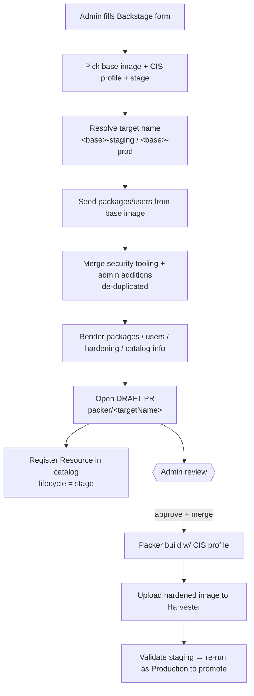

# Harvester Packer Admin-Image — Hardened & Staged Template

> The **admin** counterpart to [`harvester-packer-devimage`](../harvester-packer-devimage/).
> Where the dev template is for *quick, self-service test images*, this one builds
> **CIS-hardened, staged** images with a **review-gated** (no auto-merge) GitOps flow.

| | Dev template | Admin template (this one) |
|---|---|---|
| Audience | Developers | Platform admins |
| Purpose | Quick test VMs | Hardened, production-bound images |
| Hardening | none | CIS Level 1 / Level 2 profile + security tooling |
| Stages | `*-dev` | `*-staging` → `*-prod` (promotion) |
| PR flow | auto-merge on green | **draft PR, manual review & merge** |
| Target name | `u26-dev` | `u26-staging` / `u26-prod` |

---

## What it does

## Form parameters

| Group | Field | Notes |
|---|---|---|
| Base Image | `baseImage` | ubuntu22 / ubuntu26 / opensuse-leap / rocky |
| Hardening | `cisProfile` | CIS Level 1 (baseline) or Level 2 (defense-in-depth) |
| Hardening | `securityTooling` | Packages baked in (default: auditd, aide, fail2ban, unattended-upgrades) |
| Stage | `stage` | `staging` (build & validate) or `production` (promotion) |
| Users | `users` | Same merge/de-dup semantics as the dev template |
| Packages | `packages` | Extra packages beyond base + tooling |

## Generated files (in the PR, under `packer/<targetName>/`)

- `packages.yaml` — base packages + security tooling + admin additions (de-duplicated)
- `users.yaml` — base users + admin additions (merged by name)
- `hardening.yaml` — **new**: `cisProfile`, `stage`, `tooling` — consumed by the build
- `catalog-info.yaml` — Resource of type `packer-image-hardened`, `lifecycle: <stage>`

## Staging → Production promotion

1. Run the template with **Stage = Staging** → builds `<base>-staging` (e.g. `u26-staging`).
2. Validate the staging image (boot it, run your compliance scan).
3. Re-run the template with **Stage = Production** and the *same* inputs →
   builds `<base>-prod` (e.g. `u26-prod`).
4. Both PRs are **drafts**; an admin reviews and merges. Production is your gate.

> The template seeds from the base image's package/user list on every run, so a
> Production run with identical inputs reproduces the validated staging config.
> The draft PR diff is your parity check before promoting.

---

## ⚠️ Harvester-side requirements (coordination points)

This template assumes the following in `stuttgart-things/harvester` — confirm/align
these while the repo is being restructured:

1. **Per-target packer dirs.** The PR writes to `packer/<targetName>/`
   (e.g. `packer/u26-staging/`, `packer/u26-prod/`) — *separate* from the dev
   image dir `packer/<baseImage>/` so dev and hardened configs don't clobber each
   other. The build pipeline must recognise these dirs and map them to the
   matching Harvester image name.
2. **`hardening.yaml` is honoured.** The Packer build must read `hardening.yaml`
   and apply the named CIS profile (e.g. via an Ansible/CIS provisioner) and
   ensure the `tooling` packages are installed.
3. **Auto-merge is scoped.** The existing `packer-pr-build.yml` auto-merges PRs.
   That must **not** apply to these hardened/staged PRs — they are review-gated.
   Scope the auto-merge to dev dirs, or skip auto-merge when the PR is a draft /
   touches `*-staging` / `*-prod`.
4. **Seed files exist.** `packer/<baseImage>/packages.yaml` and `users.yaml` must
   exist (they do today) — they are the seed for the hardened image.

Until these are in place, run the template against a non-production branch first.

## Prerequisites (Backstage)

Same scaffolder actions as the dev template (`roadiehq:utils:jsonata`,
`utils:yaml:parse`, `fetch:plain:file`, `fetch:template:file`,
`publish:github:pull-request` with draft support, `catalog:register`) plus a
GitHub token that can open PRs on `stuttgart-things/harvester`.

## Security note

CIS hardening reduces but does not eliminate risk. Note that any users you add
still default to `NOPASSWD:ALL` sudo — for a genuinely hardened production image,
review the sudo rules and SSH key set per user before promoting to `*-prod`.
