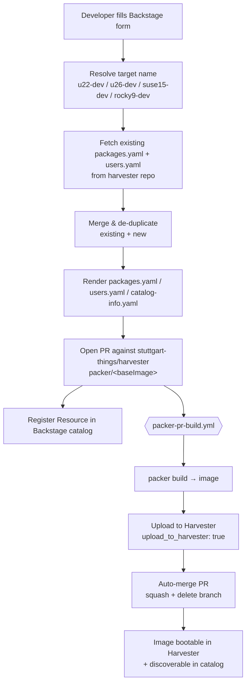

# Harvester Packer Dev-Image — Self-Service Template

> Backstage Software Template for the **Developer VM Golden-Image** self-service story:
> a developer fills out a form, and out the other end comes a fully built, bootable
> VM image — uploaded to Harvester and registered in the Backstage catalog.
> Everything in between is GitOps and CI.

---

## What it does

This template lets a developer customise a [Packer](https://www.packer.io/) base
image (users + packages) through a Backstage form and turns that into a Pull
Request against [`stuttgart-things/harvester`](https://github.com/stuttgart-things/harvester).
The PR triggers the Packer build pipeline, which builds the image, uploads it to
Harvester, and auto-merges the PR on success.



## Repository layout

```
harvester-packer-devimage/
├── template.yaml                  # Backstage scaffolder template (the form + steps)
├── README.md                      # this file
├── showcase/
│   └── slides.md                  # Slidev deck for the live showcase
└── template/                      # Nunjucks templates rendered into the PR
    ├── packages.yaml              # → packer/<baseImage>/packages.yaml
    ├── users-additions.yaml       # → packer/<baseImage>/users.yaml
    └── catalog-info.yaml          # → packer/<baseImage>/catalog-info.yaml
```

## How the steps fit together

| # | Step | Action | Purpose |
|---|------|--------|---------|
| 1 | `resolve-target-name` | `roadiehq:utils:jsonata` | Map base image → target name (or use override) |
| 2 | `fetch-existing-packages` | `fetch:plain:file` | Pull current `packages.yaml` from harvester repo |
| 3 | `parse-existing-packages` | `utils:yaml:parse` | Parse it into a list |
| 4 | `combine-packages` | `roadiehq:utils:jsonata` | `$distinct($append(existing, new))` — **de-duplicates** |
| 5 | `render-packages` | `fetch:template:file` | Render the complete `packages.yaml` |
| 6 | `fetch-existing-users` | `fetch:plain:file` | Pull current `users.yaml` |
| 7 | `parse-existing-users` | `utils:yaml:parse` | Parse it |
| 8 | `combine-users` | `roadiehq:utils:jsonata` | Merge by name — re-submitting a username **updates** instead of duplicating |
| 9 | `render-users` | `fetch:template:file` | Render the complete `users.yaml` |
| 10 | `render-catalog` | `fetch:template:file` | Render `catalog-info.yaml` (the added profile) |
| 11 | `create-pull-request` | `publish:github:pull-request` | Open PR on a per-user branch |
| 12 | `register` | `catalog:register` | Best-effort catalog registration |

## Prerequisites

**Backstage instance**
- Scaffolder actions available: `roadiehq:utils:jsonata`, `roadiehq:utils:*`,
  `utils:yaml:parse`, `fetch:plain:file`, `fetch:template:file`,
  `publish:github:pull-request`, `catalog:register`.
- A GitHub integration with a token that can open PRs on
  `stuttgart-things/harvester`.

**`stuttgart-things/harvester` repo**
- Workflows `packer-pr-build.yml` (PR trigger + auto-merge) and `packer-build.yml`.
- Repo secrets `HARVESTER_VIP` and `HARVESTER_PASSWORD`, and a `harvester`
  GitHub Environment.
- A self-hosted runner with the `kvm` label online (the Packer build runs there).

---

## Demo runbook (live showcase)

> Goal: get from an empty Backstage form to a bootable image in Harvester in
> under ~5 minutes of *talking* (the build itself runs in the background).

### Pre-flight checklist (do this BEFORE the demo)

- [ ] **Clean the upstream demo data.** In `harvester/packer/<baseImage>/users.yaml`,
      make sure no user has a placeholder SSH key (e.g. `ssh12334`). The template
      preserves existing users verbatim, so junk data shows up in your live PR diff.
- [ ] Confirm the **`kvm` runner is online** (GitHub → harvester repo → Settings → Actions → Runners).
- [ ] Confirm **Harvester is reachable** and the `harvester` environment secrets are set.
- [ ] Have an **SSH public key** ready to paste (your own — it's going into a real image).
- [ ] Pre-open three browser tabs: Backstage Create page, the harvester repo PRs, and the Harvester UI Images view.
- [ ] Optional: do a dry run an hour earlier so the runner image cache is warm.

### Act 1 — Self-Service (Backstage)

1. Backstage → **Create** → **Create Harvester VM-Template**.
2. **Base Image:** `🟠 Ubuntu 22.04 (Jammy)`. Leave the target-name override empty.
3. **Add New Users:** add one user — your name, paste your SSH public key.
   *Say:* "Existing users are preserved; I'm just adding myself."
4. **Additional Packages:** add `docker.io` and `kubectl`.
   *Say:* "These get merged with the base list and de-duplicated."
5. **Review** → the template renders a **Catalog Resource Preview** table. Show it.

### Act 2 — GitOps (the PR)

6. Click the **Pull Request** output link. Show the diff in
   `packer/ubuntu22/` — `packages.yaml` and `users.yaml` updated.
   *Say:* "Nothing magic — it's all Git. Reviewable, auditable, revertible."

### Act 3 — CI/CD (the build)

7. Open the PR's **Checks** tab → `packer-pr-build.yml` is running.
   *Say:* "Packer builds the image on a KVM runner and uploads it straight to
   Harvester. On green, the PR auto-merges and the branch is deleted."

### Act 4 — Discoverability (the payoff)

8. In **Harvester → Images**, show the new `u22-dev` image (or refresh once built).
9. In **Backstage catalog**, open the registered `u22-dev-packer-image` Resource.
10. *Close:* "From a form to a bootable golden image, fully governed by Git — that's
    the Internal Developer Platform promise made concrete."

---

## Recent hardening (vs. the original template)

- **Package de-duplication** — packages are now merged via `$distinct`, so
  submitting a package that already exists no longer creates duplicates.
- **User de-duplication / update semantics** — re-submitting an existing
  username now *updates* that entry instead of producing a duplicate user block
  (which Packer/cloud-init would choke on).
- **Concurrency-safe branches** — the PR branch is namespaced per requesting
  user (`backstage/update-<target>-<user>-config`), so two people customising the
  same base image at the same time no longer clobber each other.

## Troubleshooting

| Symptom | Likely cause | Fix |
|---|---|---|
| PR build never starts | `kvm` runner offline | Bring the self-hosted runner online |
| Build fails on upload | Harvester creds / VIP wrong | Check `HARVESTER_VIP` / `HARVESTER_PASSWORD` + `harvester` environment |
| Catalog entity missing right after run | `catalog-info.yaml` only exists on the PR branch | It appears after the PR merges (`register` is `optional: true`) |
| Junk SSH keys in the diff | Placeholder keys in upstream `users.yaml` | Clean the upstream demo data (see pre-flight) |
| Duplicate packages/users | (Pre-hardening template) | Use this version — dedup is built in |

## Security note

This builds a **developer** image: users get `NOPASSWD:ALL` sudo and their SSH
keys are baked into the image. That is intentional for dev/showcase use — call it
out explicitly and do **not** reuse this profile for production golden images.
