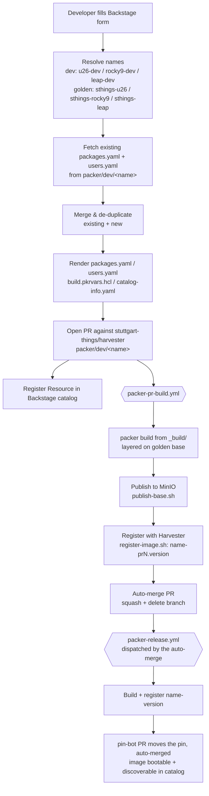

# Harvester Packer Dev-Image — Self-Service Template

> Backstage Software Template for the **developer self-service** image story:
> a developer fills out a form, and out the other end comes a fully built, bootable
> VM image — layered on a golden base, published to the MinIO artifact store,
> registered with Harvester (which downloads it from there), and registered in the
> Backstage catalog. Everything in between is GitOps and CI.

---

## What it does

This template lets a developer customise the **dev** tier of a [Packer](https://www.packer.io/)
image (users + packages) through a Backstage form and turns that into a Pull Request
against [`stuttgart-things/harvester`](https://github.com/stuttgart-things/harvester),
under `packer/dev/<name>/`. A dev image is **layered on top of the matching golden
base**, so a build only installs the delta. The PR triggers `packer-pr-build.yml`,
which builds the image, publishes it to MinIO, registers it with Harvester as
`<name>-pr<N>.<version>` as a throwaway test image, and **auto-merges** the PR on
success (unless the PR changes anything outside `packer/dev/`, which forces review).

After the merge, the auto-merge job dispatches `packer-release.yml`, which
**releases** the image from `main` as
`<name>-<version>` and opens a `pin-bot/<name>` PR that moves its pin in
[`env-config-virtualmachine.yaml`](https://github.com/stuttgart-things/harvester/blob/main/clusters/crossplane-mgmt/platform/virtual-machine/env-config-virtualmachine.yaml).
For a dev image that PR auto-merges. Harvester images are versioned and never
replaced in place, so new VMs boot from the new image once the pin PR lands;
existing VMs keep theirs until rebuilt.


```mermaid
flowchart TD
    A[Developer fills Backstage form] --> B[Resolve names<br/>dev: u26-dev / rocky9-dev / leap-dev<br/>golden: sthings-u26 / sthings-rocky9 / sthings-leap]
    B --> C[Fetch existing packages.yaml + users.yaml<br/>from packer/dev/&lt;name&gt;]
    C --> D[Merge & de-duplicate<br/>existing + new]
    D --> E[Render packages.yaml / users.yaml<br/>build.pkrvars.hcl / catalog-info.yaml]
    E --> F[Open PR against stuttgart-things/harvester<br/>packer/dev/&lt;name&gt;]
    F --> G[Register Resource in Backstage catalog]
    F --> H{{packer-pr-build.yml}}
    H --> I[packer build from _build/<br/>layered on golden base]
    I --> J[Publish to MinIO<br/>publish-base.sh]
    J --> J2[Register with Harvester<br/>register-image.sh: name-prN.version]
    J2 --> K[Auto-merge PR<br/>squash + delete branch]
    K --> M{{packer-release.yml<br/>dispatched by the auto-merge}}
    M --> N[Build + register name-version]
    N --> L[pin-bot PR moves the pin, auto-merged<br/>image bootable + discoverable in catalog]
```

## Repository layout

```
harvester-packer-devimage/
├── template.yaml                  # Backstage scaffolder template (the form + steps)
├── README.md                      # this file
├── showcase/
│   └── slides.md                  # Slidev deck for the live showcase
└── template/                      # Nunjucks templates rendered into the PR
    ├── packages.yaml              # → packer/dev/<name>/packages.yaml
    ├── users-additions.yaml       # → packer/dev/<name>/users.yaml
    ├── build.pkrvars.hcl          # → packer/dev/<name>/build.pkrvars.hcl
    └── catalog-info.yaml          # → packer/dev/<name>/catalog-info.yaml
```

## How the steps fit together

| # | Step | Action | Purpose |
|---|------|--------|---------|
| 1 | `resolve-names` | `roadiehq:utils:jsonata` | Map base image → dev + golden names |
| 2 | `fetch-existing-packages` | `fetch:plain:file` | Pull current `packages.yaml` from the dev dir |
| 3 | `parse-existing-packages` | `utils:yaml:parse` | Parse it into a list |
| 4 | `combine-packages` | `roadiehq:utils:jsonata` | `$distinct($append(existing, new))` — **de-duplicates** |
| 5 | `render-packages` | `fetch:template:file` | Render the complete `packages.yaml` |
| 6 | `fetch-existing-users` | `fetch:plain:file` | Pull current `users.yaml` from the dev dir |
| 7 | `parse-existing-users` | `utils:yaml:parse` | Parse it |
| 8 | `combine-users` | `roadiehq:utils:jsonata` | Merge by name — re-submitting a username **updates** instead of duplicating |
| 9 | `render-users` | `fetch:template:file` | Render the complete `users.yaml` |
| 10 | `render-pkrvars` | `fetch:template:file` | Render `build.pkrvars.hcl` (golden `source_url` + its `.sha256` checksum + image name) |
| 11 | `render-catalog` | `fetch:template:file` | Render `catalog-info.yaml` (type `packer-image-dev`) |
| 12 | `cleanup-workspace` | `fs:delete` | Drop the fetched `*-existing.yaml` merge inputs so they don't land in the PR |
| 13 | `create-pull-request` | `publish:github:pull-request` | Open PR on a per-user branch |
| 14 | `register` | `catalog:register` | Best-effort catalog registration |

## Prerequisites

**Backstage instance**
- Scaffolder actions available: `roadiehq:utils:jsonata`, `roadiehq:utils:*`,
  `utils:yaml:parse`, `fetch:plain:file`, `fetch:template:file`, `fs:delete`,
  `publish:github:pull-request`, `catalog:register`.
- A GitHub integration with a token that can open PRs on
  `stuttgart-things/harvester`.

**`stuttgart-things/harvester` repo**
- Workflows `packer-pr-build.yml` (PR build + publish + register + auto-merge for dev,
  which then dispatches the release) and `packer-release.yml` (release + pin PR).
  A merge made with `GITHUB_TOKEN` starts no push workflow, hence the dispatch
  (stuttgart-things/harvester#275).
- The matching **golden base must be built + published to S3 at least once** —
  the dev build pulls it over HTTPS via `source_url`, otherwise it returns 404.
- A `harvester` GitHub Environment with the secrets `HARVESTER_VIP`,
  `HARVESTER_PASSWORD`, `MINIO_ACCESS_KEY` and `MINIO_SECRET_KEY`.
- The `packer` bucket must be public-read, and Harvester must trust the CA of the
  artifact store (`settings.harvesterhci.io/additional-ca`) — Harvester downloads
  the image itself.
- A self-hosted runner with the `kvm` label online (the Packer build runs there).

---

## Demo runbook (live showcase)

> Goal: get from an empty Backstage form to a bootable image in Harvester in
> under ~5 minutes of *talking* (the build itself runs in the background).

### Pre-flight checklist (do this BEFORE the demo)

- [ ] **Golden base published.** Confirm the golden `sthings-u26` image has been
      built + published to S3 at least once (the dev build layers on it).
- [ ] Confirm the **`kvm` runner is online** (GitHub → harvester repo → Settings → Actions → Runners).
- [ ] Confirm **Harvester is reachable** and the `harvester` environment secrets are set.
- [ ] Have an **SSH public key** ready to paste (your own — it's going into a real image).
- [ ] Pre-open three browser tabs: Backstage Create page, the harvester repo PRs, and the Harvester UI Images view.
- [ ] Optional: do a dry run an hour earlier so the runner image cache is warm.

### Act 1 — Self-Service (Backstage)

1. Backstage → **Create** → **Create Harvester VM-Template**.
2. **Base Image:** `🟠 Ubuntu 26.04 LTS`. The dev image name (`u26-dev`) is derived automatically.
3. **Add New Users:** add one user — your name, paste your SSH public key.
   *Say:* "Existing users are preserved; I'm just adding myself."
4. **Additional Packages:** add `docker.io` and `kubectl`.
   *Say:* "These get merged with the existing list and de-duplicated."
5. **Review** → the template renders a **Catalog Resource Preview** table. Show it.

### Act 2 — GitOps (the PR)

6. Click the **Pull Request** output link. Show the diff in
   `packer/dev/u26-dev/` — `packages.yaml` and `users.yaml` updated.
   *Say:* "Nothing magic — it's all Git. Reviewable, auditable, revertible."

### Act 3 — CI/CD (the build)

7. Open the PR's **Checks** tab → `packer-pr-build.yml` is running.
   *Say:* "Packer builds the dev image on a KVM runner — only the delta on top of
   the golden base — publishes it to MinIO and has Harvester pull it from there.
   On green, the PR auto-merges and the branch is deleted."

### Act 4 — Discoverability (the payoff)

8. After the merge, show the release run and the `pin-bot/u26-dev` PR moving the
   pin; in **Harvester → Images**, show the new `u26-dev-<version>` image.
9. In **Backstage catalog**, open the registered `u26-dev-packer-image` Resource.
10. *Close:* "From a form to a bootable image layered on a governed golden base,
    fully driven by Git — that's the Internal Developer Platform promise made concrete."

---

## Design notes

- **Folder-driven, dev tier.** The PR writes to `packer/dev/<name>/`, which the
  `packer-pr-build.yml` path filter picks up. The companion
  [`harvester-packer-adminimage`](../harvester-packer-adminimage/) template drives
  the **golden** tier (`packer/golden/<name>/`) with a review-gated draft PR.
- **Layered on golden.** `build.pkrvars.hcl` points `source_url` at the golden base
  published to S3, so a dev build only installs the delta. `source_checksum` points
  at the `.sha256` that `publish-base.sh` writes next to it, so a dev build never
  layers on a truncated or half-published golden.
- **Package de-duplication** — packages are merged via `$distinct`, so submitting a
  package that already exists no longer creates duplicates.
- **User de-duplication / update semantics** — re-submitting an existing username
  *updates* that entry instead of producing a duplicate user block (which
  Packer/cloud-init would choke on).
- **Concurrency-safe branches** — the PR branch is namespaced per requesting user
  (`backstage/dev-<name>-<user>-config`), so two people customising the same dev
  image at the same time no longer clobber each other.

## Troubleshooting

| Symptom | Likely cause | Fix |
|---|---|---|
| PR build never starts | Change landed outside `packer/dev/**` | Confirm the PR touches `packer/dev/<name>/` |
| Dev build fails on `source_url` 404 | Golden base never published to S3 | Build + merge the golden image first (admin template) |
| Dev build fails with `Checksums did not match` | Golden artifact truncated or re-published mid-build | Re-run the golden build (it re-publishes image + `.sha256`) |
| Publish step fails | MinIO creds wrong | Check `MINIO_ACCESS_KEY` / `MINIO_SECRET_KEY` in the `harvester` environment |
| Register fails / image stuck importing | Harvester creds, or `x509: certificate signed by unknown authority` | Check `HARVESTER_VIP` / `HARVESTER_PASSWORD`; refresh `settings.harvesterhci.io/additional-ca` |
| New image built, VMs still boot the old one | Pin PR not merged yet (or release skipped with `UPLOAD_TO_HARVESTER=false`) | Check the `pin-bot/<name>` PR; existing VMs only switch when rebuilt |
| PR doesn't auto-merge | PR also touches a golden dir | Intentional — golden changes force review; split the PR |
| Catalog entity missing right after run | `catalog-info.yaml` only exists on the PR branch | It appears after the PR merges (`register` is `optional: true`) |

## Security note

This builds a **developer** image: users get `NOPASSWD:ALL` sudo and their SSH
keys are baked into the image. That is intentional for dev/showcase use — call it
out explicitly and do **not** reuse this profile for production golden images.
Use the admin template for hardened golden images.
