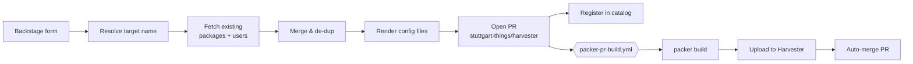
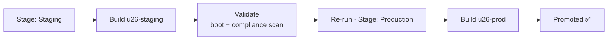

# From Click to Bootable VM

### Self-Service Golden Images with **Backstage · Packer · Harvester**

A platform-engineering showcase — stuttgart-things

Press <kbd>Space</kbd> to start

---
layout: statement
---

# The problem

Developers wait **days** for a VM image with the right users and tools.

Platform teams hand-roll Packer configs, SSH into runners, and copy images around by hand.

There is no golden path.

---
layout: default
---

# The idea: a self-service golden path

<v-clicks>

- A developer opens **one form** in Backstage
- Picks a base image, adds their **users** and **packages**
- Everything else is **GitOps + CI** — no tickets, no SSH, no manual Packer

</v-clicks>

Form → Pull Request → Packer build → image in Harvester → entry in the catalog.

---
layout: default
---

# How it flows

Twelve scaffolder steps — fetch, parse, merge, render, publish, register.

---
layout: section
---

# Live demo

4 acts · ~5 minutes

---
layout: default
---

# Act 1 — Self-Service

In **Backstage → Create → Create Harvester VM-Template**:

<v-clicks>

- **Base image:** Ubuntu 22.04 (Jammy)
- **Add user:** name + SSH public key
- **Add packages:** `docker.io`, `kubectl`
- Review → **Catalog Resource Preview**

</v-clicks>

> "Existing users and packages are preserved.
> I'm just adding myself and two tools — and they get
> **de-duplicated** against the base list automatically."

---
layout: default
---

# Act 2 — GitOps

<v-clicks>

- The template opens a **Pull Request** on `stuttgart-things/harvester`
- Diff lives in `packer/ubuntu22/` — `packages.yaml` + `users.yaml`
- Branch is **namespaced per user** → no collisions

</v-clicks>

Nothing magic. It's all Git —
reviewable, auditable, revertible.

---
layout: default
---

# Act 3 — CI/CD

<v-clicks>

- The PR triggers **`packer-pr-build.yml`**
- Packer builds the image on a **KVM runner**
- Image is **uploaded to Harvester** (`upload_to_harvester: true`)
- On green → PR **auto-merges**, branch deleted

</v-clicks>

The human approved a form. The machine did the build, the upload, and the merge.

---
layout: default
---

# Act 4 — Discoverability

<v-clicks>

- New **`u22-dev`** image appears in **Harvester → Images**
- Registered **Resource** in the Backstage catalog
- Boot a VM from it — done

</v-clicks>

> "From a form to a bootable golden image,
> fully governed by Git.
> That's the IDP promise made concrete."

---
layout: section
---

# Part 2 — the Admin path

Same engine, different governance: **hardened & staged** images

---
layout: default
---

# Two golden paths, one engine

| | 🧑‍💻 Dev template | 🛡️ Admin template |
|---|---|---|
| **Audience** | Developers | Platform admins |
| **Purpose** | Quick test VMs | Hardened, prod-bound images |
| **Hardening** | none | CIS Level 1 / 2 + tooling |
| **Stages** | `u26-dev` | `u26-staging` → `u26-prod` |
| **PR flow** | auto-merge on green | **draft PR, 4-eyes review** |

Self-service speed for devs · governed promotion for admins.

---
layout: default
---

# Admin — Hardening

In **Create Hardened Harvester VM-Template (Admin)**:

<v-clicks>

- Pick a **CIS profile** — Level 1 (baseline) or Level 2 (defense-in-depth)
- Choose **security tooling** — `auditd`, `aide`, `fail2ban`, `unattended-upgrades`…
- It's merged into the base package list and written to **`hardening.yaml`**

</v-clicks>

The Packer build reads <code>hardening.yaml</code> and applies the CIS benchmark — compliance as config, in Git.

---
layout: default
---

# Admin — Staging & promotion

<v-clicks>

- Staging first — build and **validate** `u26-staging`
- Same inputs, **Production** stage → `u26-prod`
- The draft-PR diff is your **parity check** before promoting

</v-clicks>

---
layout: default
---

# Admin — Review-gated

<v-clicks>

- The admin template opens a **draft Pull Request** — never auto-merged
- A second admin **reviews** the hardening config and merges
- Production is a **deliberate human gate**, not an accident

</v-clicks>

Devs get speed.
Admins get control.
Same GitOps engine.

---
layout: default
---

# What we hardened for this showcase

<v-clicks>

- 🧹 **Package de-dup** — `$distinct` merge, no duplicate entries
- 👥 **User update semantics** — re-submitting a name updates, not duplicates
- 🌿 **Concurrency-safe branches** — per-user PR branch names
- 🟠 **Ubuntu 26.04 LTS** — replaced the obsolete interim release
- 🛡️ **Admin template** — CIS hardening, staging→prod promotion, 4-eyes review
- 📋 **Demo runbook + pre-flight checklist** — clean data, warm runner, green path

</v-clicks>

---
layout: statement
---

# Takeaway

A **form** on one end. A **bootable, catalogued image** on the other.

Everything between is **Git and CI** — governed, repeatable, self-service.

One engine, two paths: speed for devs · control for admins.

Backstage · Packer · Harvester — stuttgart-things

---
layout: center
class: text-center
---

# Thank you

Questions?

Template: <code>backstage-resources/templates/harvester-packer-devimage</code>

